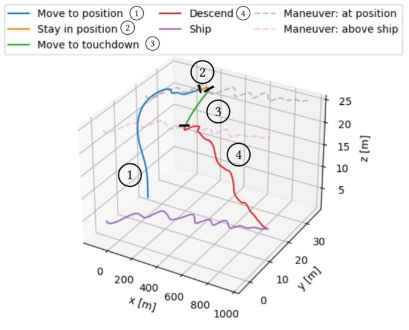

<!--
SPDX-FileCopyrightText: 2023 German Aerospace Center (DLR)

SPDX-License-Identifier: CC-BY-NC-ND-4.0
-->

> This tool is based on the paper ``Temporal Behavior Trees: Robustness and Segmentation`` TODO: add link to paper in repo
>
> TODO: add bib

> If you encounter any issues, have questions, or need assistance, feel free to reach out:  sebastian dot schirmer at dlr dot de

## Table of Content
- [Temporal Behavior Trees: Robustness and Segmentation](#temporal-behavior-trees-robustness-and-segmentation)
  - [Getting Started](#getting-started)
  - [Brief Summary of the Supported Operators](#brief-summary-of-the-supported-operators)
  - [Contributors](#contributors)
  - [Contributing](#contributing)
  - [Changes](#changes)
  - [License](#license)

# Temporal Behavior Trees: Robustness and Segmentation

Temporal Behavior Trees (TBT) are a specification formalism for monitoring behaviors.
They are inspired by behavior trees that are commonly used to program robotic applications, but allow to specify temporal properties in their leaf nodes. 
Therefore, they can be easily retrofitted to existing behavior trees.

For instance, consider the following behavior tree that specifies the landing sequence of an unmanned aircraft (1) *move to position*, (2) *stay in position*, (3) *move to touchdown*, and (4) *descend*:

Given such a TBT specification and a trace, i.e., a sequence of events of a system, we can compute the corresponding robustness.
Robustness provides an quantitative interpretation *how* much the TBT specification was satisfied or violated.

Further, we can use a TBT specification to segment a trace.
That means that we assign portions of the provided specification to segments of the given trace.
Such a segmentation then helps to better explain which portions of the specification were satisfied or violated.

It is also useful to visualize the resulting segmentation, as shown below for the landing maneuver:

## Getting Started

1. [Install Rust](https://www.rust-lang.org/)
1. Specify a TBT, e.g., as done [here](src/tree/shipdeck_landing/lateral_maneuver.rs)
1. [Provide a Trace by implementing ``get_trace``](src/tree/shipdeck_landing/get_trace_and_tree.rs)
1. [Provide a Trace by implementing ``get_trace``](src/tree/shipdeck_landing/get_trace_and_tree.rs)
1. [Replace the ``user_defined``-function by your own](src/main.rs)
1. Call ``cargo build`` or ``cargo build --release`` 
1. Call ``cargo run -- --help`` to get help on the command-line-usage.
 
For instance:

``cargo run --release -- -s -f .\res\logs_wind_front_Lateral\`` runs segmentation using subsampling on a provided logfile.

Using the [visualization script](scripts/visualize_ship_landing.py), we can easily plot a segmentation by, e.g., ``python visualize_ship_landing.py plot -b Lateral -s 5000 10000 20000 -e 0 -l ../res/logs_wind_front_Lateral/`` where ``5000, 10000, 20000`` represent beginning of segments (omitting 0), ``-b`` states the expected behavior and is used to plot the dotted lines, and ``-e`` represents the number of skipped entries due to subsampling.
We can also replay the flight by, e.g.,  ``python visualize_ship_landing.py live -l ../res/logs_wind_front_Lateral/ -b Lateral -f 0.005 0.1 2.0``.

For more information call ``python visualize_ship_landing.py --help``.

## Brief Summary of the Supported Operators

TBT ``T:=``
- ``Fallback([T_1,...,T_n])``: At least one of the subtrees must eventually be satisfied.
- ``Sequence([T_1, T_2])``: Each subtree must be satisfied in order from left to right.
- ``Parallel(m, [T_1,...,T_n])``: At least ``m`` of the subtrees must be simultaneously satisfied.
- ``Timeout(t, T)``: The subtree must be satisfied by a finite prefix of length ``t``.
- ``Kleene(n, T)``: There must be ``n`` repetitions of the subtree to be satisfied.
- ``Leaf(S)``: STL formula ``S`` must be satisfied.

STL ``S:=``
- ``Atomic(function)``: The function must return a positive number to be satisfied, otherwise it is violated.
- ``Conjuntion(S_1, S_2)``: Both subformulas must be satisfied.
- ``Disjunction(S_1, S_2)``: One of the subformulas or both must be satisfied.
- ``Neg(S)``: The subformulas must be violated.
- ``Next(S)``: The subformula must be satisfied in the next step.
- ``Eventually(S)``: Eventually the subformula must be satisfied.
- ``Globally(S)``: The subformula must always be satisfied.
- ``Until(S_1, S_2)``: The subformula ``S_1`` must be satisfied *until* ``S_2`` is satisfied.
- ``EventuallyInterval(l, u, S)``: Eventually within ``l`` and ``u`` steps, the subformula must be satisfied.
- ``GloballyInterval(l, u, S)``: Always within ``l`` and ``u`` steps, the subformula must be satisfied.
- ``UntilInterval(l, u, S_1, S_2)``: Within ``l`` and ``u`` steps, the subformula ``S_1`` must be satisfied *until* ``S_2`` is satisfied.

The TBT operators are defined [here](src/behaviortree.rs) and the STL operators are defined [here](src/stl.rs).

For more details, we refer to the paper. TODO: add paper link here

## Contributors
- TODO: add contributor
  
## Contributing

Please see [the contribution guidelines](CONTRIBUTING.md) for further information about how to contribute.

## Changes

Please see the [Changelog](CHANGELOG.md) for notable changes of the material.

## License

Please see the file [LICENSE.md](LICENSE.md) for further information about how the content is licensed.