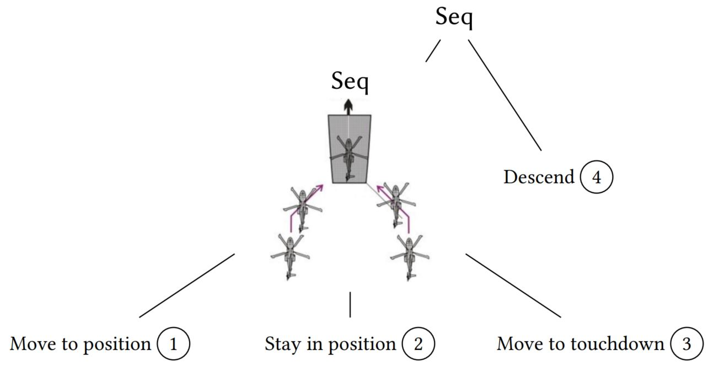
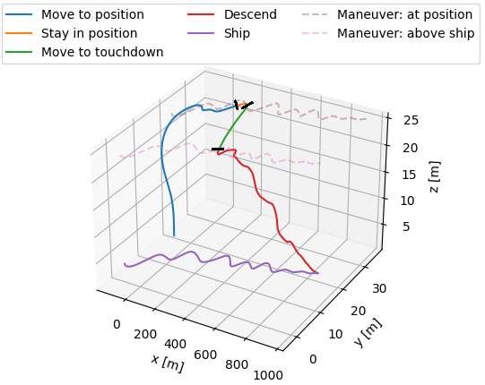

<!--
SPDX-FileCopyrightText: 2023 German Aerospace Center (DLR)

SPDX-License-Identifier: CC-BY-NC-ND-4.0
-->

> This tool is based on the paper ``Temporal Behavior Trees: Robustness and Segmentation`` TODO: add link to paper in repo
>
> TODO: add bib

> If you encounter any issues, have questions, or need assistance, feel free to reach out:  sebastian dot schirmer at dlr dot de

## Table of Content
- [Temporal Behavior Trees: Robustness and Segmentation](#temporal-behavior-trees-robustness-and-segmentation)
  - [Getting Started](#getting-started)
  - [Folder Structure](#folder-structure)
  - [Brief Summary of the Supported Operators](#brief-summary-of-the-supported-operators)
  - [Docker Environment](#docker-environment)
  - [How to Interpret the Output Format](#how-to-interpret-the-output-format)
  - [Contributors](#contributors)
  - [Contributing](#contributing)
  - [Changes](#changes)
  - [License](#license)

# Temporal Behavior Trees: Robustness and Segmentation

Temporal Behavior Trees (TBT) are a specification formalism for monitoring behaviors.
They are inspired by behavior trees that are commonly used to program robotic applications, but allow to specify temporal properties in their leaf nodes. 
Therefore, they can be easily retrofitted to existing behavior trees.

For instance, consider the following behavior tree that specifies the landing sequence of an unmanned aircraft (1) *move to position*, (2) *stay in position*, (3) *move to touchdown*, and (4) *descend*:

Given such a TBT specification and a trace, i.e., a sequence of events of a system, we can compute the corresponding robustness.
Robustness provides an quantitative interpretation *how* much the TBT specification was satisfied or violated.

Further, we can use a TBT specification to segment a trace.
That means that we assign portions of the provided specification to segments of the given trace.
Such a segmentation then helps to better explain which portions of the specification were satisfied or violated.

It is also useful to visualize the resulting segmentation, as shown below for the landing maneuver:

## Getting Started
Requires Rust to compile source code and Python for visualization.
1. [Install Rust](https://www.rust-lang.org/)
1. Specify a TBT, e.g., as done [here](src/tree/shipdeck_landing/lateral_maneuver.rs)
1. [Provide a Trace by implementing ``get_trace``](src/tree/shipdeck_landing/get_trace_and_tree.rs)
1. [Provide a Tree by implementing ``get_tree``](src/tree/shipdeck_landing/get_trace_and_tree.rs)
1. [Replace the ``user_defined``-function by your own](src/main.rs)
1. Call ``cargo build`` or ``cargo build --release`` 
1. Call ``cargo run -- --help`` to get help on the command-line-usage
1. Call ``cargo test`` to see if the tests are successful
 
For instance:

``cargo run --release -- -s -f .\res\logs_wind_front_Lateral\`` runs segmentation using subsampling on a provided logfile. 
For this example, ``get_trace`` and ``get_tree`` is already provided.

Using the [visualization script](scripts/visualize_ship_landing.py), we can easily plot a segmentation by, e.g., ``python visualize_ship_landing.py plot -b Lateral -s 5000 10000 20000 -e 0 -l ../res/logs_wind_front_Lateral/`` where ``5000, 10000, 20000`` represent beginning of segments (omitting 0), ``-b`` states the expected behavior and is used to plot the dotted lines, and ``-e`` represents the number of skipped entries due to subsampling.
We can also replay the flight by, e.g.,  ``python visualize_ship_landing.py live -l ../res/logs_wind_front_Lateral/ -b Lateral -f 0.005 0.1 2.0``.

For more information call ``python visualize_ship_landing.py --help``.

## Folder Structure
- [figs](figs) are resources used for this readme document
- [res](res) contains the logfiles used in the HSCC paper
  - The logfolder name specifies the wind direction (*front* or *side*) and the anticipated maneuver (*45Deg*, *Lateral*, *Oblique*, or *Straight*)
  - Each flight consists of two csv-files: one for the ship and one for the aircraft
  - The files contain the position, the velocity, and the angles for the ship and the aircraft
- [scripts](scripts) provides auxiliary resources
  - [Makefile](scripts/Makefile) is used for Rust profiling
  - [clean.sh](scripts/clean.sh) is used for cleaning up the repository
  - [infer_parameters_visualization.py](scripts/infer_parameters_visualization.py) is used for the [run.sh](scripts/run.sh) script to extract the segments from the produced output files
  - [run.sh](scripts/run.sh) is a script that executes our segmentation tool on all the available [logfiles](res) and produces png files to further analyze ([infer_parameters_visualization.py](scripts/infer_parameters_visualization.py))
  - [visualize_ship_landing.py](scripts/visualize_ship_landing.py) is a script that is used to produced the png files that show the flight and the computed segments
- [src](src) contains the source code  
    - [lib.rs](src/lib.rs) provides a package of TBTs functions that can be used by others 
      - It requires a user to provide two functions [get_trace()](src/lib.rs) and [get_tree()](src/lib.rs)
      - This repository provides these functions for the ship landing: [tree/](src/tree/)
    - [main.rs](src/main.rs) is an example that uses [lib.rs](src/lib.rs) and the user-defined functions [tree/](src/tree/)
    - [stl.rs](src/stl.rs) provides the syntax and semantics for STL formulas
    - [behaviortree.rs](src/behaviortree.rs) provides the syntax and semantics for TBTs
    - [command_line_parser.rs](src/command_line_parser.rs) is used to interface with the command line
    - [csv_reader.rs](src/csv_reader.rs) represent auxiliary functions such as reading a csv-file
    - [table.rs](src/table.rs) represents the main data structure for the dynamic programming
    - [test.rs](src/tests.rs) contains multiple test cases that can be executed to test whether the compilation works
    - [tree/](src/tree/) is an example implementation for the *UserProvidedFunctions* required by [lib.rs](src/lib.rs)
      - [atomics/](src/tree/) are implemented function that take trace data (eg provided by reading a csv-file) and output a robustness verdict.
      - [*_maneuver.rs](src/tree/) are instances of TBTs using [behaviortree.rs](src/behaviortree.rs)
- [Dockerfile](Dockerfile) just c/p the whole repository and builds it to produce a docker container that then can run [run.sh](scripts/run.sh) to procude the HSCC artifacts

> To use the TBT tool for a different use-case, a user needs to provide the *UserProvidedFunction* ([get_trace()](src/lib.rs) and [get_tree()](src/lib.rs)) similar to what has been done here for the ship landing ([tree/](src/tree/)). I.e., he/she needs to extract logdata into a *Trace* struct and needs to build the TBT.

## Brief Summary of the Supported Operators

TBT ``T:=``
- ``Fallback([T_1,...,T_n])``: At least one of the subtrees must eventually be satisfied.
- ``Sequence([T_1, T_2])``: Each subtree must be satisfied in order from left to right.
- ``Parallel(m, [T_1,...,T_n])``: At least ``m`` of the subtrees must be simultaneously satisfied.
- ``Timeout(t, T)``: The subtree must be satisfied by a finite prefix of length ``t``.
- ``Kleene(n, T)``: There must be ``n`` repetitions of the subtree to be satisfied.
- ``Leaf(S)``: STL formula ``S`` must be satisfied.

STL ``S:=``
- ``Atomic(function)``: The function must return a positive number to be satisfied, otherwise it is violated.
- ``Conjuntion(S_1, S_2)``: Both subformulas must be satisfied.
- ``Disjunction(S_1, S_2)``: One of the subformulas or both must be satisfied.
- ``Neg(S)``: The subformulas must be violated.
- ``Next(S)``: The subformula must be satisfied in the next step.
- ``Eventually(S)``: Eventually the subformula must be satisfied.
- ``Globally(S)``: The subformula must always be satisfied.
- ``Until(S_1, S_2)``: The subformula ``S_1`` must be satisfied *until* ``S_2`` is satisfied.
- ``EventuallyInterval(l, u, S)``: Eventually within ``l`` and ``u`` steps, the subformula must be satisfied.
- ``GloballyInterval(l, u, S)``: Always within ``l`` and ``u`` steps, the subformula must be satisfied.
- ``UntilInterval(l, u, S_1, S_2)``: Within ``l`` and ``u`` steps, the subformula ``S_1`` must be satisfied *until* ``S_2`` is satisfied.

The TBT operators are defined [here](src/behaviortree.rs) and the STL operators are defined [here](src/stl.rs).

For more details, we refer to the paper. TODO: add paper link here

## Docker Environment
1. Install [Docker](https://docs.docker.com/engine/install/)
2. Builder Docker Image: ``docker build -t tbt .``
3. Run Docker Container: ``docker run -it --rm --name tbt-container tbt bash``
4. To test if the container is working reproduce paper results by (being in the docker bash):
   - Run ``. scripts/run.sh`` that takes all logfiles and computes the segmentation.    
      - The script calls the tool as defined [here](#getting-started) for each logfolder that exists in [res](res).
      - The results for each run are stored in the respective logfolder.
   - Check results of each logfiles that are located in the following subfolder: ``cd ./res/``
   - The files in the folders [res/<folder\>](res) are called ``subsampling_result.txt`` and ``subsamplingAndLazy_result.txt``.
   - Besides the result-files, for each segmentation, the script produces a `.png`-plot. Every `.png`-plot that has a name that ends with `aX`, where `X` is a number, represents an alternative segmentations where the number corresponds to the alternative in the result-file.  For instance, Figure 9 of the HSCC paper can then be found [here](res/logs_wind_front_Oblique/subsampling_result_a3.png).
   - (Optional) To display plots copy them from the docker container to your host machine; dont use the docker bash.
     -  ``docker cp <container_id>:<location_png/results> <location_to_be_stored>`` (copy whole folder or individual files), e.g., ``docker cp e7ba94d69e94:/app/res ./docker``
     -  to get container_id call ``docker ps``

> The Dockerfile uses multiple stages. The first stage builds the executable using rust/cargo and the second stage uses a debian environment to execute it. Therefore, there are no cargo-commands available in the container while running.
 
## How to Interpret the Output Format
Running e.g. `cargo run --release -- -l -c -s -f /<your-foulder>/TBT-Segmentation/res/logs_wind_front_Lateral/` produces an output that contains the following lines:

> SETTING:  
> Logfile: /root/canbedeleted/TBT-Segmentation/res/logs_wind_front_Lateral/  

represents the logfile name.

> Approximations: (lazy evaluation= true, subsampling = true(delta: 100))

show which approximations are enabled.
In this case, lazy evauation and subsampling with a delta of 100 are enabled.

> Trace length: 252

provides that the length of the trace is 252 after subsampling. 
I.e. the original file has >25.000 entries.

> Temporal behavior tree:  
  Sequence(22)[
    Fallback(20)[ <...> ]]

shows a pretty print of the used TBT with its node identifiers.
Here, the root node has ID 22.

> Created tree table with 733,194 entries.  
Created formula table with 828,828 entries.

are information on the table used for dynamic programming.

> Statistics: Robustness value is 0.05925286 with 3,277,611 total tree lookups and 1,503,504 formula lookups

provides information how effective dynamic programming was.

> Get segmentation after 0 seconds.

states that it took 0 seconds to compute a segmentation.

> Approximate segmentation with robustness 0.05925286 and subsampling delta of 0.5564443 is:

is the beginning of the segmentation. The following lines provide information on the segments.

> lower:          0   upper:         78   value:      0.31250286  segment: Leaf(0 move_to_position_lateral)

represent one segment.
It states that the leaf node `move_to_position_lateral` was assigned to the segment that begins at index 0 and ends at index 78. 
Further its robustness value is 0.31, i.e., the trace segment did satisfy this node.

## Contributors
- Sebastian Schirmer
  
## Contributing

Please see [the contribution guidelines](CONTRIBUTING.md) for further information about how to contribute.

## Changes

Please see the [Changelog](CHANGELOG.md) for notable changes of the material.

## License

Please see the file [LICENSE.md](LICENSE.md) for further information about how the content is licensed.
